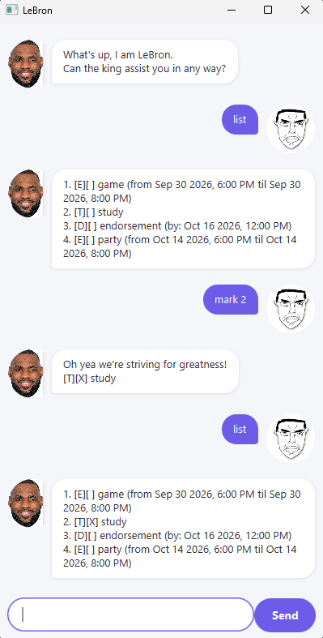

# LeBron



LeBron is a desktop task-tracking chatbot for people who prefer typing to clicking, with a basketball-slang personality. It supports todos, deadlines, events, and recurring tasks, and saves your list automatically between sessions.

* [Quick start](#quick-start)
* [Features](#features)
  * [Adding a todo: `todo`](#adding-a-todo-todo)
  * [Adding a deadline: `deadline`](#adding-a-deadline-deadline)
  * [Adding an event: `event`](#adding-an-event-event)
  * [Adding a recurring task: `recur`](#adding-a-recurring-task-recur)
  * [Listing all tasks: `list`](#listing-all-tasks-list)
  * [Marking a task as done: `mark`](#marking-a-task-as-done-mark)
  * [Unmarking a task: `unmark`](#unmarking-a-task-unmark)
  * [Deleting a task: `delete`](#deleting-a-task-delete)
  * [Finding tasks: `find`](#finding-tasks-find)
  * [Exiting the program: `bye`](#exiting-the-program-bye)
  * [Saving the data](#saving-the-data)

## Quick start

1. Ensure you have Java 25 installed.
2. Get `LeBron.jar` by cloning [this repo](https://github.com/jianyang999/ip) and running `gradlew shadowJar`; the jar is created at `build/libs/LeBron.jar`.
3. Run it with:
   ```
   java -jar LeBron.jar
   ```
   The chat window shown above should appear.
4. Type a command into the input box and press Enter (or click Send) to try it out. Some examples:
   * `list` — shows all your tasks
   * `todo read book` — adds a todo
   * `deadline return book by 2019-10-15 1800` — adds a deadline
   * `bye` — exits the app

## Features

> **Notes about the command format**
> * Words in `UPPER_CASE` are parameters to be supplied by you, e.g. in `todo DESCRIPTION`, `DESCRIPTION` is a parameter which can be used as `todo read book`.
> * Dates and times use the format `yyyy-MM-dd HHmm`, e.g. `2019-10-15 1800` for 15 October 2019, 6:00 PM.

### Adding a todo: `todo`

Adds a todo (a task with no date attached) to the list.

Format: `todo DESCRIPTION`

Example: `todo read book`

Expected outcome:
```
More todo!
[T][ ] read book
1 tasks left to grind now!
```

### Adding a deadline: `deadline`

Adds a task that must be done by a specific date/time.

Format: `deadline DESCRIPTION by DATE_TIME`

Example: `deadline return book by 2019-10-15 1800`

### Adding an event: `event`

Adds a task that occurs over a start and end date/time. The end must be after the start.

Format: `event DESCRIPTION from START_DATE_TIME to END_DATE_TIME`

Example: `event project meeting from 2019-10-16 0900 to 2019-10-16 1100`

### Adding a recurring task: `recur`

Adds a task that repeats at a fixed interval, e.g. a weekly project meeting. Marking a recurring task as done advances it to its next occurrence instead of finishing it forever, so it keeps reappearing on your list.

Format: `recur DESCRIPTION every {day|week|month} from DATE_TIME`

Example: `recur weekly sync every week from 2019-10-15 0930`

Expected outcome:
```
Got you, this one's on repeat!
[R][ ] weekly sync (every week, next due: Oct 15 2019, 9:30 AM)
1 tasks left to grind now!
```

If you later run `mark 1` on this task, it doesn't get crossed off for good — instead its next-due date jumps forward by one week (or day/month), and it stays on your list.

### Listing all tasks: `list`

Shows every task currently on your list, numbered from 1.

Format: `list`

### Marking a task as done: `mark`

Marks the given task as done. For a recurring task, this instead advances it to its next occurrence (see [Adding a recurring task](#adding-a-recurring-task-recur)).

Format: `mark INDEX`

Example: `mark 2` marks the 2nd task in the list as done.

### Unmarking a task: `unmark`

Marks the given task as not done.

Format: `unmark INDEX`

Example: `unmark 2`

### Deleting a task: `delete`

Removes the given task from the list.

Format: `delete INDEX`

Example: `delete 2`

### Finding tasks: `find`

Finds tasks whose description contains the given keyword (case-insensitive).

Format: `find KEYWORD`

Example: `find book`

### Exiting the program: `bye`

Exits the application.

Format: `bye`

### Saving the data

Your task list is saved automatically to disk after every command that changes it, so there's no need to save manually. Data is loaded automatically the next time you start the app.
